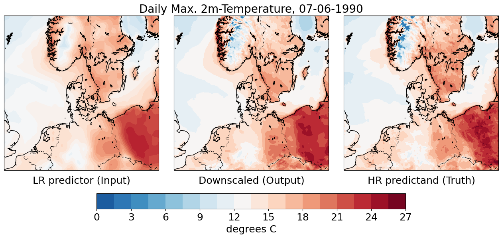

## Surface Temperature Downscaling for Heatwave Detection using Deep-Learning Models
### Luc Pares, based on an implementation by Robbie A. Watt & Laura A. Mansfield <https://arxiv.org/abs/2404.17752>

This repo contains code to go alongside my Master's Thesis, made in collaboration with the Danish Meteorological Institute, where I train a U-Net model to perform statistical downscaling on daily max. 2m-temperature for heatwave detection, with different learning setups. I compare the results with a Vision Transformer from the DeepR library (<https://github.com/ECMWFCode4Earth/DeepR>), as previously implemented at DMI. The  model is based on the implementation by T. Karras et al. (<https://arxiv.org/abs/2206.00364>) and the code is adapted from <https://github.com/NVlabs/edm>.

## File structure
* ./: The Jupyter notebook called `HW-thresholds.py` computes the thresholds used in the HW definition from a reference climatology. The two other Jupyter notebooks can be used for data analysis and post processing.
* src: contains code used to train model and run files (including model weights)
* inference: contains inference and plotting scripts -- only compute_spectrum.py was used for the project, the other scripts were left untouched
* download_CERRA-ERA5: contains scripts for preprocessing the input data

## Usage
### Download CERRA and ERA5 data
The script `download_CERRA-ERA5/preprocess_project.sh` transforms the monthly files containing hourly data from ERA5 and CERRA (publicly accessible from the Copernicus Data Store) for all required years and saves files into a directory named `data/CERRA-ERA5/`. The file `download_CERRA-ERA5/generate_samples.sh` then creates the samples for the models. You may need to edit data directories. 

I also use variables that are constant in time for the land sea mask and the orography. These are currently stored in `data/CERRA-ERA5/cerra_const_sfc_variables.nc` or can be manually downloaded from CDS ([https://cds.climate.copernicus.eu/](url)).

### Training
To train the U-Net from scratch, simply edit the configuration in `src/TrainUnet.py` script and run it from its parent directory. The `src/TrainDiffusion.py` script was not fully adapted.

### Inference
After training, the script `src/Inference.py` can be used to perform inference on the test samples.
